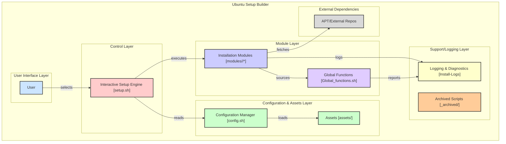

# Universal Linux Setup Builder

A powerful, modular setup builder for Ubuntu and Arch Linux systems. This toolkit provides a modular approach to system configuration and software installation.

| Badges | | | |
|--------|-|-|-|
|  |  |  | [](https://github.com/neop26/ubupublic/actions/workflows/smoke.yml) |
| [](https://github.com/neop26/ubupublic/stargazers) | [](https://github.com/neop26/ubupublic/network) | [](https://github.com/neop26/ubupublic/issues) | [](https://github.com/neop26/ubupublic/pulls) |
| [](https://github.com/neop26/ubupublic/commits/main) | [](https://github.com/neop26/ubupublic/graphs/contributors) | [](https://github.com/neop26/ubupublic) | |
| [](https://www.gnu.org/software/bash/) | [](https://ubuntu.com/) | [](https://archlinux.org/) | |

## Architecture Overview



## Features

- Modular installers for Ubuntu and Arch powered by shared helpers
- Interactive menu-driven workflow with consistent logging
- Hardened package handling (idempotent installs, no curl | bash shortcuts)
- Detailed per-run logs written to `Install-Logs/`
- Tested combinations for Ubuntu 20.04/22.04/24.04 and Arch Linux
- Automated smoke checks via GitHub Actions to prevent regressions

## Installation

Clone the repository:

```bash
git clone https://github.com/neop26/ubupublic.git
cd ubupublic
chmod +x setup.sh
```

## Usage

Run the main setup script:

```bash
./setup.sh
```

Follow the interactive prompts to select the modules you want to install.

## Available Modules

| Module | Description |
|--------|-------------|
| System Update | Update system packages and install essential tools |
| ZSH | Install ZSH with Oh-My-ZSH configuration |
| Network Tools | Install network diagnostic and management tools |
| Fonts | Install recommended font packages |
| Fastfetch | Install and configure Fastfetch system information tool |
| Azure Dev | Setup Azure development environment (partial on Arch) |
| Docker | Install Docker and Docker Compose |
| NVIDIA Drivers | Install NVIDIA drivers for GPU support |
| Static IP | Configure static IP address (Arch: manual guidance) |
| Cockpit | Setup Cockpit web management console |
| Git Config | Configure Git settings |
| Node.js | Install Node.js and npm |
| Apache | Install Apache web server |
| Create User | Create a new user account |
| PowerShell | Install PowerShell (Ubuntu). Arch: AUR guidance |

## Customization

### Adding New Modules

1. Create a new script in `modules/<os>/` (e.g., `modules/ubuntu/mytool.sh`)
2. Source the shared helpers: `source "$REPO_DIR/core/Global_functions.sh"`
3. Add your module to the `MODULES` array in `setup.sh`

### Configuration

Edit the `config.sh` file to customize default settings.

## Directory Structure

```text
ubupublic/
|-- assets/               # Static configs, images, branding, etc.
|-- core/                 # Shared functions/utilities (logging, prompts, etc.)
|-- modules/
|   |-- ubuntu/           # Ubuntu-specific install modules
|   `-- arch/             # Arch-specific install modules
|-- scripts/              # Validation helpers (smoke/tests)
|-- config.sh             # Canonical configuration (sourced by all scripts)
|-- setup.sh              # Main entrypoint (OS detection, menu, orchestration)
|-- _archived/           # Legacy scripts, not loaded by default
`-- README.md
```

## Logging

All installation logs are stored in the `Install-Logs` directory with timestamps for easy troubleshooting.

## Dependencies

- Ubuntu (20.04/22.04/24.04) or Arch Linux (rolling)
- Bash 4.0+
- Internet connection for package downloads

## Credits

This project was inspired by [JaKooLit](https://github.com/JaKooLit/Debian-Hyprland) scripts for deploying Hyprland on Debian and other distributions.

## License

MIT - see `LICENSE`.

## CI & Tests

- `smoke` job: runs `bash scripts/smoke.sh` to verify module manifests, syntax, and sourcing
- `ubuntu-modules` job: runs `bash scripts/test_ubuntu_modules.sh` against a safe subset on `ubuntu-latest`
- Local smoke: `bash scripts/smoke.sh`
- Local Ubuntu module sampler: `bash scripts/test_ubuntu_modules.sh`
## Changelog

### v2.2.0 - 2025-09-22
- Consolidated helpers into `core/Global_functions.sh`; removed duplicates
- Canonicalized `config.sh` and directory paths
- Completed migration to `modules/<os>/*`; removed legacy `install-scripts/`
- Neofetch deprecated -> Fastfetch module added and used by default
- Hardened installers (no curl-to-bash; better pathing/quoting)
- Added Arch parity modules (update, fastfetch, zsh, docker, etc.)
- Improved `setup.sh` orchestration and messages

### v2.1.0 - 2024-09-11
- Replaced Neofetch with Fastfetch in docs; preliminary module changes

### v2.0.0 - 2024-05-25
- Architecture redesign, interactive menu, logging, modularization


