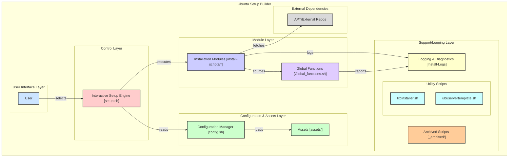

# Ubuntu Setup Builder

A powerful and intuitive setup builder for Ubuntu systems. This toolkit provides a modular approach to system configuration and software installation.

| Badges | | | |
|--------|-|-|-|
|  |  |  | |
| [](https://github.com/neop26/ubupublic/stargazers) | [](https://github.com/neop26/ubupublic/network) | [](https://github.com/neop26/ubupublic/issues) | [](https://github.com/neop26/ubupublic/pulls) |
| [](https://github.com/neop26/ubupublic/commits/main) | [](https://github.com/neop26/ubupublic/graphs/contributors) | [](https://github.com/neop26/ubupublic) | |
| [](https://www.gnu.org/software/bash/) | [](https://ubuntu.com/) | | |

## Architecture Overview



## Features

- 📦 Modular design for easy customization
- 🛠️ Enhanced error handling and logging
- 🔄 Interactive menu-driven interface
- 📊 Progress indicators for long-running operations
- 📝 Detailed logging of all operations
- 🌐 Support for various Ubuntu versions
- 🔒 Security-focused configurations
- 🚀 Performance optimizations

## Installation

Clone the repository:

```bash
git clone https://github.com/neop26/ubupublic.git
cd ubupublic
chmod +x setup.sh
```

## Usage

Run the main setup script:

```bash
./setup.sh
```

Follow the interactive prompts to select the modules you want to install.

## Available Modules

| Module | Description |
|--------|-------------|
| System Update | Update system packages and install essential tools |
| ZSH | Install ZSH with Oh-My-ZSH configuration |
| Network Tools | Install network diagnostic and management tools |
| Fonts | Install recommended font packages |
| Fastfetch | Install and configure Fastfetch system information tool |
| Azure Dev | Setup Azure development environment |
| Docker | Install Docker and Docker Compose |
| NVIDIA Drivers | Install NVIDIA drivers for GPU support |
| Static IP | Configure static IP address |
| Cockpit | Setup Cockpit web management console |
| Git Config | Configure Git settings |
| Node.js | Install Node.js and npm |
| Apache | Install Apache web server |
| Create User | Create a new user account |
| PowerShell | Install PowerShell for Linux |

## Customization

### Adding New Modules

1. Create a new script file in the `install-scripts` directory
2. Make sure to source the `Global_functions.sh` file
3. Add your module to the `MODULES` array in `setup.sh`

### Configuration

Edit the `config.sh` file to customize default settings.

## Directory Structure

```bash
ubupublic/
├── assets/                # Static configs, images, branding, etc.
├── modules/
│   ├── ubuntu/            # Ubuntu-specific install modules
│   └── arch/              # Arch-specific install modules
├── core/                  # Shared functions/utilities (logging, prompts, etc.)
├── config.sh              # Canonical config (sourced by all scripts)
├── setup.sh               # Main entrypoint (OS detection, menu, orchestration)
├── README.md
└── _archived/             # Legacy scripts, not loaded by default
```

## Logging

All installation logs are stored in the `Install-Logs` directory with timestamps for easy troubleshooting.

## Dependencies

- Ubuntu (tested on 20.04, 22.04, and 24.04)
- Bash 4.0+
- Internet connection for package downloads

## Credits

This project was inspired by [JaKooLit](https://github.com/JaKooLit/Debian-Hyprland) scripts for deploying Hyprland on Debian and other distributions.

## License

This project is licensed under the MIT License - see the LICENSE file for details.

## Status

- Core utilities consolidated under `core/Global_functions.sh`
- Ubuntu modules live under `modules/ubuntu/`
- Legacy `install-scripts/` retained for reference and will be archived
- Neofetch is deprecated; Fastfetch is the default and supported
- Updated default timezone to Pacific/Auckland
- Enhanced system information display capabilities

### v2.0.0 - 2024-05-25

- Complete architecture redesign
- Added interactive menu system
- Enhanced error handling and logging
- Improved module organization
- Added progress indicators

### v1.1.0 - 2023-12-18

- Added NVIDIA driver installer
- Various bugfixes and improvements

### v1.0.0 - 2023-05-06

- Initial release
- Tested on Ubuntu 23.10 and 24.04
