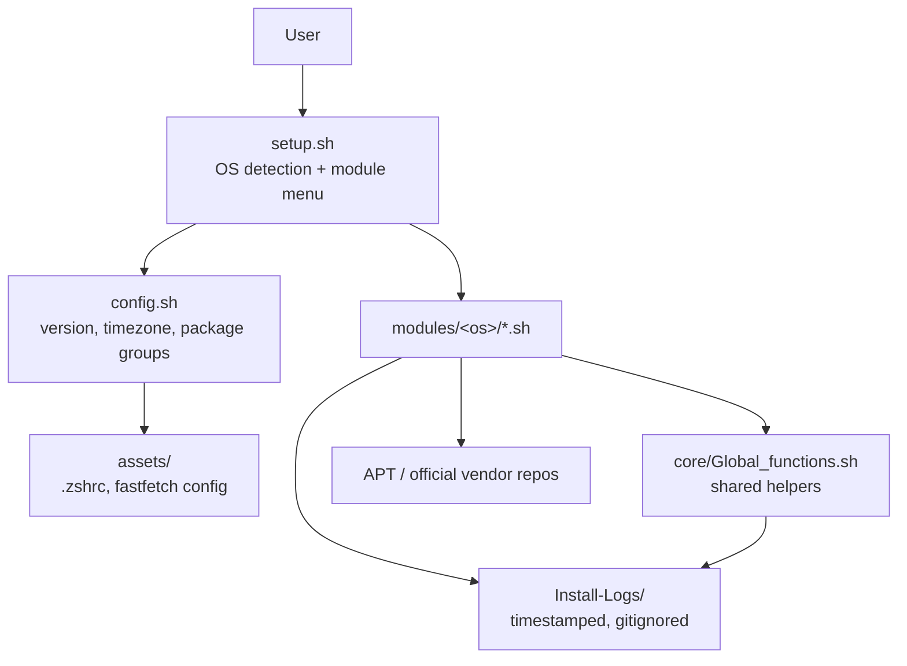

# Universal Linux Setup Builder

A modular, menu-driven setup builder for Ubuntu and Arch Linux. Pick the components you want, and each one runs as an independent, re-runnable module.

| | | | |
|--------|-|-|-|
|  |  |  | [](https://github.com/neop26/ubupublic/actions/workflows/smoke.yml) |
| [](https://www.gnu.org/software/bash/) | [](https://ubuntu.com/) | [](https://archlinux.org/) | |

---

## Quick start

```bash
git clone https://github.com/neop26/ubupublic.git
cd ubupublic
chmod +x setup.sh
./setup.sh
```

Do **not** run as root. Modules call `sudo` only where they need to, and the script refuses to start as root.

---

## Architecture


```mermaid
flowchart TD
    U["User"] --> ISE["setup.sh<br/>OS detection + module menu"]
    ISE --> CM["config.sh<br/>version, timezone, package groups"]
    CM --> AS["assets/<br/>.zshrc, fastfetch config"]
    ISE --> IM["modules/&lt;os&gt;/*.sh"]
    IM --> GF["core/Global_functions.sh<br/>shared helpers"]
    IM --> Log["Install-Logs/<br/>timestamped, gitignored"]
    GF --> Log
    IM --> APT["APT / official vendor repos"]
```

| Component | Responsibility |
|---|---|
| `setup.sh` | Detects the distribution, presents the menu, dispatches modules |
| `config.sh` | Version, default timezone, directory paths, package groups, colours |
| `core/Global_functions.sh` | `install_package`, `ask_yes_no`, `backup_file`, `check_service`, `download_file` |
| `modules/ubuntu/`, `modules/arch/` | One self-contained script per component |
| `Install-Logs/` | Timestamped logs per run — gitignored, never committed |

Modules are independent: each sources the global functions itself, so it can be run directly without `setup.sh`.

---

## Available modules

Selected from the `setup.sh` menu, or run directly as `./modules/ubuntu/<name>.sh`.

### System

| Module | Description |
|---|---|
| `update` | Update all system packages |
| `hostname` | Set the system hostname (validates RFC 1123, keeps `/etc/hosts` in sync) |
| `staticip` | Configure a static IP via netplan |
| `createuser` | Create an additional sudo-capable user |
| `nettools` | Network diagnostic tools (`net-tools`, `nmap`, `iperf3`, `traceroute`) |

### Security

| Module | Description |
|---|---|
| `ufw` | Configure the UFW firewall. Allows SSH **before** enabling, so an active session can't be locked out |
| `sshhardening` | Key-only login, `PermitRootLogin no`, `MaxAuthTries 3`, X11 forwarding off |
| `passwordlesssudo` | Optional NOPASSWD sudo — full, scoped, or extended-cache. Requires key-only SSH first |

### Shell and desktop

| Module | Description |
|---|---|
| `zsh` | ZSH with Oh-My-Zsh, autosuggestions and syntax highlighting |
| `fonts` | Fira Code, Noto, Font Awesome |
| `fastfetch` | Fastfetch with a custom config |
| `aurapps` | Desktop applications (AUR on Arch, Flatpak on Ubuntu) |
| `nvidiadrivers` | Proprietary NVIDIA drivers |

### Development

| Module | Description |
|---|---|
| `docker` | Docker Engine + Compose from Docker's official signed repository |
| `nodejsinstaller` | Node.js and npm |
| `azuredev` | Azure CLI and related tooling |
| `installpwsh` | PowerShell |
| `gitconfig` | Git identity and sensible defaults |
| `copilot` | GitHub Copilot CLI |

### Services

| Module | Description |
|---|---|
| `cockpit` | Cockpit web console (port 9090) |
| `apache2` | Apache web server |

---

## Usage

At the menu, enter module numbers separated by spaces:

```
Enter your selection (numbers separated by spaces, or A): 1 3 9
```

| Input | Effect |
|---|---|
| `1 3 9` | Select those modules |
| `A` | Select all |
| `N` | Select none |
| `Q` | Quit |

Invalid or out-of-range entries are reported and skipped. Duplicates are removed and modules always run in menu order.

Run a single module without the menu:

```bash
./modules/ubuntu/docker.sh
```

---

## Security notes

This project installs software and changes system configuration. Points worth knowing:

- **No piping remote scripts into a shell.** Docker installs from its official APT repository with a verified GPG key. The `curl … | sudo sh` convenience path was deliberately removed.
- **`ufw` allows SSH before enabling the firewall**, detecting the live SSH port rather than assuming 22.
- **`sshhardening` verifies its own outcome.** It confirms an authorized key exists before disabling password login, validates with `sshd -t` before reloading, and re-reads the effective setting with `sshd -T` rather than assuming the write took effect. Its drop-in is named `01-` deliberately: sshd honours the **first** match, so a `99-` file would be silently overridden by `50-cloud-init.conf`.
- **`passwordlesssudo` refuses to run while SSH accepts passwords**, and validates with `visudo -c` before installing, rolling back if the sudoers tree fails to parse.
- **`gitconfig` no longer stores credentials in plaintext.** It uses `cache` or `libsecret` where available.
- **Logs are gitignored.** `Install-Logs/` can contain hostnames and paths and is never committed.

Passwordless sudo, even when scoped, is not a hard security boundary — `apt`, `systemctl` and `docker` can each be used to obtain root. Scoping limits accidents, not a determined attacker.

---

## Directory structure

```
.
├── setup.sh                  # entry point: OS detection + menu
├── config.sh                 # version, timezone, paths, package groups
├── core/
│   └── Global_functions.sh   # shared helpers
├── modules/
│   ├── ubuntu/               # Ubuntu/Debian modules
│   └── arch/                 # Arch modules
├── assets/                   # .zshrc, fastfetch config
├── scripts/                  # smoke tests
├── Install-Logs/             # per-run logs (gitignored)
└── _archived/                # superseded scripts, kept for reference
```

---

## Adding a module

1. Create `modules/<os>/<name>.sh`
2. Start with a shebang **on line one**, then source the shared helpers:

```bash
#!/bin/bash
SCRIPT_DIR="$(dirname "$(readlink -f "$0")")"
REPO_DIR="$(cd "$SCRIPT_DIR/../.." && pwd)"
# shellcheck disable=SC1090
source "$REPO_DIR/core/Global_functions.sh"
```

3. Add an entry to the `MODULES` array in `setup.sh` as `name:Description`
4. Add the filename to `modules/ubuntu/ubuntu_install_modules.txt`
5. `chmod +x` it, and verify with `bash -n modules/<os>/<name>.sh`

A blank line before `#!/bin/bash` makes the kernel ignore the shebang and run the script under `dash`, where `source` does not exist. Keep it on line one.

---

## Configuration

Edit `config.sh`:

| Variable | Purpose |
|---|---|
| `VERSION` | Displayed at startup |
| `DEFAULT_TIMEZONE` | Change to your own region |
| `ESSENTIAL_PACKAGES` | Base packages |
| `FONT_PACKAGES`, `NETWORK_PACKAGES`, `DEV_PACKAGES` | Grouped installs |

---

## Requirements

- Ubuntu 20.04+ / Debian, or Arch Linux
- Bash 4.0+
- `sudo` privileges
- Internet access

---

## Logging

Every run writes to `Install-Logs/install-YYYYMMDD-HHMMSS.log`, including full APT output. Logs are gitignored.

```bash
ls -lt Install-Logs/ | head
grep -i error Install-Logs/install-*.log
```

---

## CI and tests

`scripts/smoke.sh` runs in GitHub Actions on push and pull request, checking that modules are syntactically valid and safe to source.

Check everything parses before committing:

```bash
for f in setup.sh config.sh core/*.sh modules/*/*.sh; do bash -n "$f" || echo "FAIL $f"; done
```

---

## Changelog

### v2.3.0
- Added `ufw`, `sshhardening` and `passwordlesssudo` modules
- **Fixed the menu parser.** It used substring matching, so any input containing the letter `a` silently selected *every* module
- Removed the `curl | sudo sh` path from `docker.sh`; official signed repository only
- Fixed `staticip.sh`: netplan removed `gateway4`, which made the module fail on current releases. Now writes `routes:`, disables conflicting configs, and applies via `netplan try` with automatic rollback
- Fixed missing/misplaced shebangs in `hostname.sh`, `lxcinstaller.sh` and `ubudockerimage.sh` — these ran under `dash` and failed to source the shared helpers
- `hostname.sh` now validates the name and updates `/etc/hosts`
- `gitconfig.sh` no longer writes plaintext credentials
- Added `hostname` to the menu; reconciled the module list with the modules on disk
- `.gitignore`: corrected Windows-style backslash paths, excluded `Install-Logs/`

### v2.2.0
- GitHub Copilot CLI module
- Improved Fastfetch installation and error handling
- CI support for static IP and default-shell changes

### v2.1.0
- Arch Linux support
- Modular restructure into `modules/<os>/`

### v2.0.0
- Initial modular release

---

## License

MIT — see [LICENSE](LICENSE).
